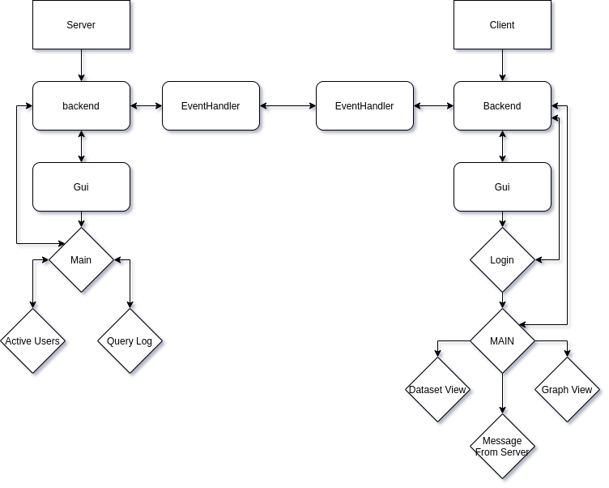
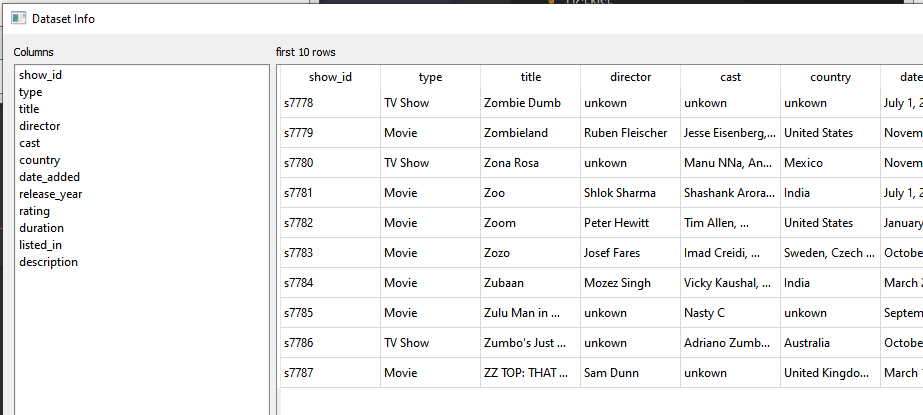

# Advanced Programming Project

Multi-Client Server in Python

[Short preview video](https://youtu.be/MfB26fM2ehM)

# How to launch

```bash
cd client/
python main.py

#########

cd server/
python main.py
```

# To Improve

- threading.Thread should be changed to QtCore.QThread to support proper signaling between frontend and backend
- Add authorization on messages

# Groepsleden

 - [Andreas Maerten](https://github.com/Yimura)
 - [Joren vanGoethem](https://github.com/Joren-vanGoethem)

# Taak Verdeling

Andreas
- Backend Server logica
- Socket communicatie en message parsing
- Pandas (datahandler)

Joren
- GUI (PyQt5, PyQtgraph)
- Pandas om data te filter/queryen (datahandler)

Veel van de backend code is in een shared session gemaakt geweest.

# Opbouw applicatie



# Totale Werktijd

30 uur over beide groepsleden
15 uur elk met dat we meestal in dezelfde sessies aan het coderen waren

# Gebruikte Dataset

netflix movies en TV shows dataset met gegevens over films en series

Preview:


# Geïmplementeerde Functionaliteit

## Basis functionaliteit
- [x] Bij minimum drie opdrachten moeten er vooraf één of meerdere parameters opgevraagd
worden om zo de zoekopdracht te verfijnen.
- [x] Bij minimum één zoekopdracht moet er een grafiek kunnen gegenereerd worden
- [x] Bij minimum één zoekopdracht moet er statistische data kunnen opgevraagd worden.

## Client side
- [x] moderator die alle ‘belangrijke’ activiteiten kan waarnemen via een logvenster
- [x] cliënts die zoekopdrachten kunnen opvragen en het resultaat kunnen weergeven.
- [x] client moet zich registreren (naam, nickname, emailadres) en/of aanmelden
- [x] de client moet verschillende zoekopdrachten kunnen opvragen. Waar nodig worden ook extra parameters doorgestuurd.
- [x] de cliënt geeft de gegevens op via tabel of een grafische manier (afbeelding) weer

## Server Side
- [x] de moderator kan ten alle tijde kunnen nagaan wie er online is;
- [x] de moderator moet de gegevens van alle cliënts kunnen opvragen;
- [x] De zoekopdrachten gebeuren langs serverzijde op de beschikbare
data.
- [x] de servermoderator houdt bij welke zoekopdrachten er opgevraagd worden.
- [x] de servermoderator kan ook raadplegen welke zoekopdrachten er populair zijn.
- [x] de servermoderator kan een melding naar de aangemelde cliënts sturen.

# GUI

Voor de GUI hebben we gebruik gemaakt van PyQt5 hiermee kunnen we drag en drop UI's maken die toch nog gemakkelijk te linken zijn aan code.

Links:
- https://realpython.com/python-pyqt-gui-calculator/
- https://build-system.fman.io/pyqt5-tutorial
